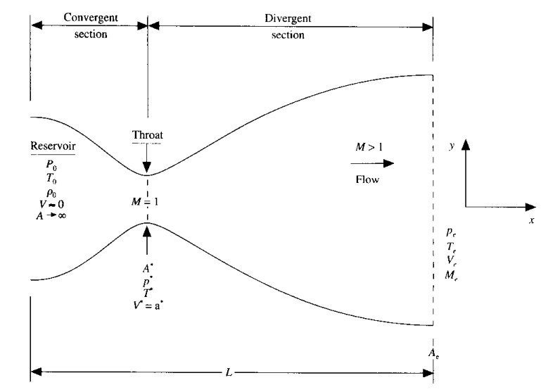

# Quasi 1D Supersonic Nozzle Flow with MacCormack Method

Code to solve the **Quasi 1D supersonic nozzle flow equations** using the **MacCormack Method**. Implementing both the **conservative** and **non-conservative** forms of the governing equations and also perform a **grid dependence test**.

  

<b>Figure 1:</b> Isentropic Nozzle Flow Schematic from *CFD Basics and Applications* by J. D. Anderson

## MacCormack Method:

The **MacCormack method** is a widely used discretization scheme for the numerical solution of hyperbolic partial differential equations. It is an explicit scheme that is second-order accurate and consists of two steps: **Predictor** and **Corrector**, which use forward and backward differencing schemes, respectively.

### Governing Equations

The formulae for the **Conservative** and **Non-Conservative** forms are provided below:

### Conservative Form:

- **Continuity Equation**:

$$
\frac{\partial U_1}{\partial t} = -\frac{\partial F_1}{\partial x}
$$

- **Momentum Equation**:

$$
\frac{\partial U_2}{\partial t} = -\frac{\partial F_2}{\partial x} + J_2
$$

- **Energy Equation**:

$$
\frac{\partial U_3}{\partial t} = -\frac{\partial F_3}{\partial x}
$$

where:

- $(U_1 = \rho A)$
- $(U_2 = \rho Av)$
- $(U_3 = \rho A \left( \frac{T}{\gamma - 1} + \frac{\gamma}{2} v^2 \right))$

These are the **solution vectors**.

The **flux vectors** are:

- $(F_1 = \rho A v)$
- $(F_2 = \rho A v + \frac{1}{\gamma} \rho A)$
- $(F_3 = \rho \left( \frac{e}{\gamma - 1} + \frac{\gamma}{2} v^2 \right) v A + \rho v A)$

The **source term** is:

$$
J_2 = \frac{1}{\gamma} \rho \frac{\partial A}{\partial x}
$$

### Non-Conservative Form:

- **Continuity Equation**:

$$
\frac{\partial \rho}{\partial t} = -\rho \frac{\partial v}{\partial x} - \rho v \frac{\partial \ln(A)}{\partial x} - v \frac{\partial \rho}{\partial x}
$$

- **Momentum Equation**:

$$
\frac{\partial v}{\partial t} = -v \frac{\partial v}{\partial x} - \frac{1}{\gamma} \left( \frac{\partial T}{\partial x} + \frac{T}{\rho} \frac{\partial \rho}{\partial x} \right)
$$

- **Energy Equation**:

$$
\frac{\partial T}{\partial t} = -v \frac{\partial T}{\partial x} - (\gamma - 1) T \left( \frac{\partial v}{\partial x} + v \frac{\partial \ln(A)}{\partial x} \right)
$$

### Note:

All of the above equations are **non-dimensional**.

## Results:

|                                   | Density Ratio | Temperature Ratio | Pressure Ratio | Mach Number |
|-----------------------------------|---------------|-------------------|----------------|-------------|
| Exact Analytical Solution          | 0.634         | 0.833             | 0.528          | 1.000       |
| Non-Conservative Form (30 Points)  | 0.639         | 0.836             | 0.534          | 0.999       |
| Non-Conservative Form (60 Points)  | 0.638         | 0.835             | 0.533          | 1.000       |
| Conservative Form (30 Points)      | 0.650         | 0.840             | 0.546          | 0.982       |
| Conservative Form (60 Points)      | 0.638         | 0.835             | 0.533          | 0.999       |

